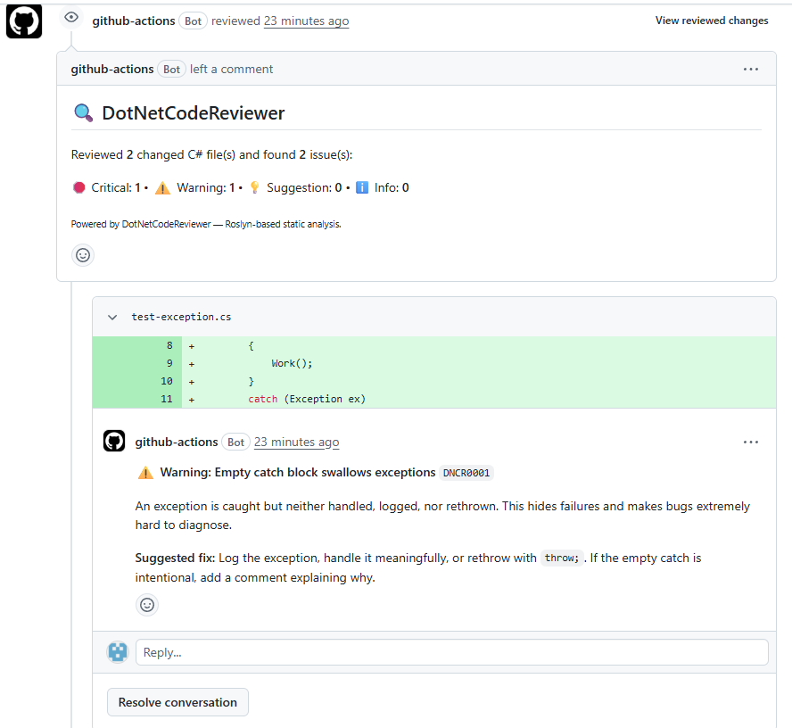
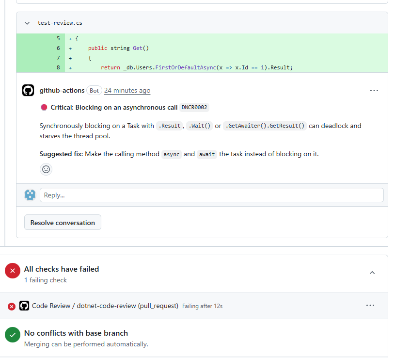

# DotNetCodeReviewer GitHub Action

Automatic **C#/.NET static code review on every pull request.** This action sends the C# files changed in a PR to [DotNetCodeReviewer](https://dotnetcodereviewer-api.azurewebsites.net) and posts the findings back as an inline PR review  security issues, performance problems, async bugs, and design smells, right where the code was changed.

Built on Roslyn. Powered by the same engine as the DotNetCodeReviewer MCP server and REST API.

## See it in action

When you open a pull request, DotNetCodeReviewer reviews the changed C# files and posts its findings as **inline comments  right on the line that triggered them**, with the severity, rule ID, and a suggested fix:




No copy-pasting code into a chat box, no separate dashboard  the review shows up in your PR, automatically, on every push.

## What it catches

- **Security**  SQL injection, hardcoded secrets, weak cryptography
- **Performance**  N+1 query patterns, client-side evaluation
- **Async correctness**  blocking on async (`.Result`/`.Wait()`), async void, sync EF calls
- **Maintainability**  long methods, too many parameters, god classes, empty catches, undisposed `IDisposable`

## Quick start

1. **Get an API key.** Sign up at the [DotNetCodeReviewer site](https://dotnetcodereviewer-api.azurewebsites.net) (14-day Pro trial, no card required). A Pro or Team key is recommended so the daily quota covers CI runs.

2. **Add the key as a repository secret** named `DNCR_API_KEY` (Settings → Secrets and variables → Actions → New repository secret).

3. **Add the workflow** at `.github/workflows/code-review.yml`:

```yaml
name: Code Review
on:
  pull_request:
permissions:
  contents: read
  pull-requests: write
jobs:
  dotnet-code-review:
    runs-on: ubuntu-latest
    steps:
      - uses: actions/checkout@v4
      - uses: dotnetcodereviewer/DotNetCodeReviewer-action@v1
        with:
          api-key: ${{ secrets.DNCR_API_KEY }}
```

That's it. Open a PR that changes a `.cs` file and the review appears as comments.

## Inputs

| Input | Required | Default | Description |
| --- | --- | --- | --- |
| `api-key` | yes |  | Your DotNetCodeReviewer API key. Use a repository secret. |
| `api-url` | no | the hosted API | Override only if self-hosting the API. |
| `github-token` | no | `github.token` | Token used to post the review. The default is fine. |
| `fail-on` | no | `critical` | Fail the check at this severity or higher: `none`, `suggestion`, `warning`, `critical`. |
| `max-files` | no | `50` | Cap on changed C# files reviewed per run. |

## Outputs

| Output | Description |
| --- | --- |
| `total-issues` | Total issues found across reviewed files. |
| `critical-issues` | Number of critical issues found. |

## How it works

On a pull request, the action lists the changed C# files, sends each one's content to the API, and submits a single PR review. Inline comments are attached only to lines the PR actually changed (so you see findings on your new code, not the whole file). A summary comment reports the totals. With `fail-on` set, the check fails when issues at or above the chosen severity are found  so you can block merges on critical problems.

## Notes

- The action reviews **changed C# files only**, not the whole repo, so it stays fast and within quota.
- Only file **content** is sent to the API  never your repo metadata or secrets.
- If the API quota is reached mid-run, the action stops early and notes it in the summary rather than failing hard.

## Permissions

The workflow needs `pull-requests: write` to post the review. If your organization restricts the default `GITHUB_TOKEN`, grant that permission in the workflow (as shown above).

---

Questions or feedback: open an issue on the [action repository](https://github.com/dotnetcodereviewer/DotNetCodeReviewer-action/issues).